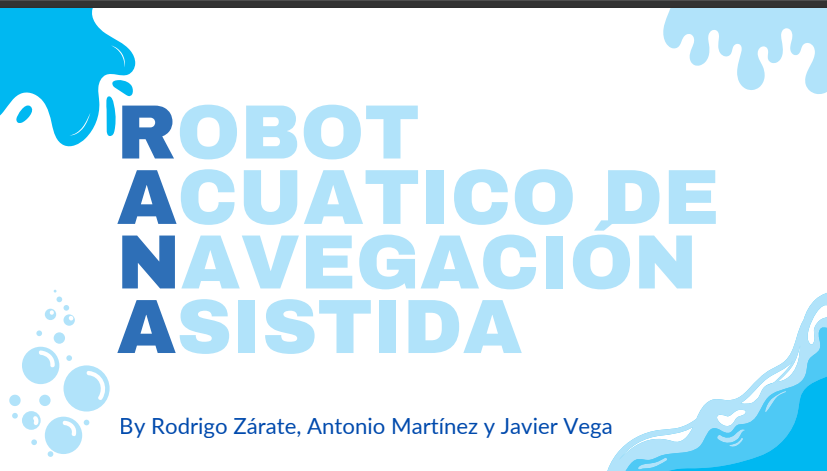

 #Proyecto RANA
 La contaminación de lagos, estanques y pequeños cuerpos de agua es un problema creciente que afecta tanto al medio ambiente como a las comunidades locales. La acumulación de basura plástica, hojas y residuos orgánicos provoca daños en la biodiversidad, genera malos olores y dificulta el acceso al agua para fines recreativos o agrícolas.

 La limpieza manual de estos espacios resulta complicada y poco eficiente, por lo que surge la necesidad de soluciones accesibles, autónomas y adaptadas a estos entornos. Este proyecto propone el diseño de un robot acuático de navegación asistida, capaz de recolectar residuos flotantes de forma económica, sustentable y escalable

[Descargar especificación (PDF)](rana12.pdf)
 
#Marco “real-ganar-vale la pena” aplicado a RANA

Portafolio_JVT/
├─ docs/
│  ├─ index.md
│  ├─ about.md
│  ├─ Marco_real_ganar_vale_la_pena.pdf
├─ mkdocs.yml

[Descargar el documento (PDF)](Marco_real_ganar_vale_la_pena.pdf)

