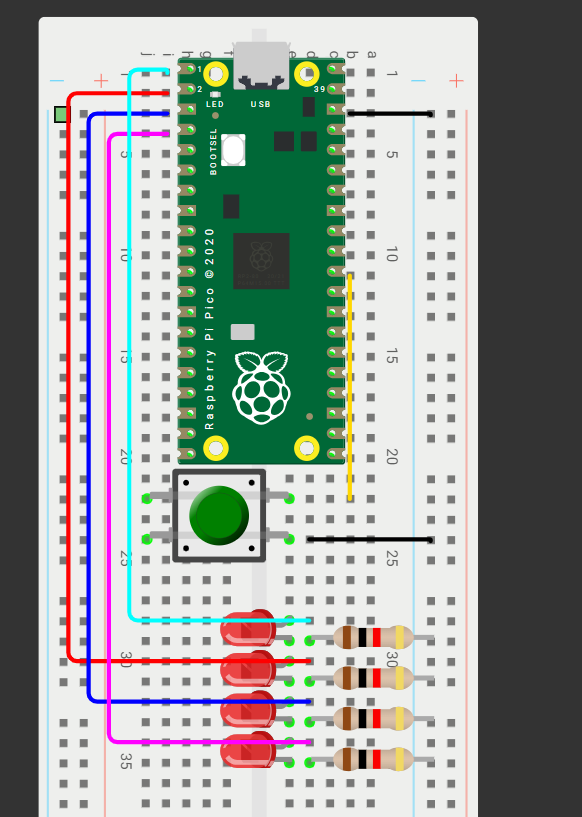
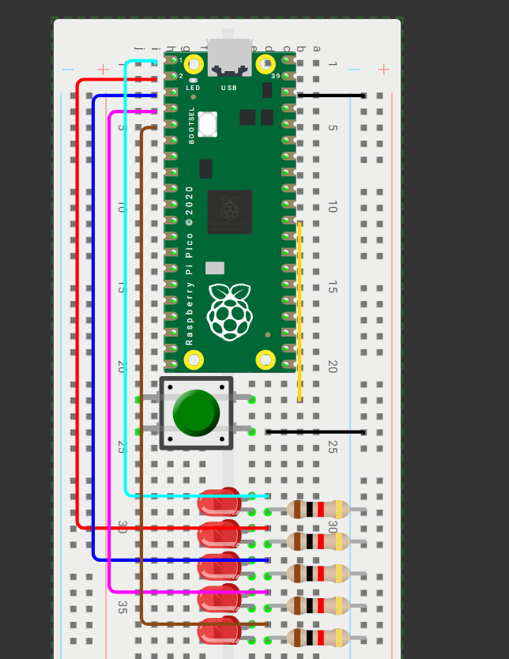

#Outputs básicos

##Contador binario de bits
En 4 LEDS debe mostrarse un contador del 0 al 15 en binario cada segundo

##Código:
```

include "pico/stdlib.h"
include "hardware/gpio.h"
 
define A 0
define B 1
define C 2
define D 3
 
int main() {
    const uint32_t MASK = (1u<<A) | (1u<<B) | (1u<<C) | (1u<<D);
    gpio_init_mask(MASK);
    gpio_set_dir_masked(MASK, MASK);
    while (true) {
        for (uint8_t i = 0; i < 16; i++) {
            gpio_put_masked(MASK, i << A);
            sleep_ms(500);
        }
    }
}
 
```


```
##Barrido de leds
include "pico/stdli-b.h"
include "hardware/gpio.h"
define A 0  
define B 1  
define C 2  
define D 3
define E 4  
int main() {
   const uint32_t MASK = (1u<<A) | (1u<<B) | (1u<<C) | (1u<<D) | (1u<<E);
   gpio_init_mask(MASK);
   gpio_set_dir_out_masked(MASK);  
   gpio_clr_mask(MASK);            
   while (true) {
       for (int i = 0; i < 5; ++i) {
           gpio_clr_mask(MASK);                
           gpio_set_mask(1 << i);              
           sleep_ms(300);
       }
       for (int i = 3; i > 0; --i) {
           gpio_clr_mask(MASK);
           gpio_set_mask(1 << i);
           sleep_ms(300);
       }
   }
}



```

```
##Secuencia en código grey

include "pico/stdlib.h"
include "hardware/gpio.h"
 
define LED0 0
define LED1 1
define LED2 2
define LED3 3
 
uint8_t binario_a_gray(uint8_t num) {
    return num ^ (num >> 1);
}
 
int main() {
    const uint32_t MASK = (1u<<LED0) | (1u<<LED1) | (1u<<LED2) | (1u<<LED3);
 
    gpio_init_mask(MASK);
    gpio_set_dir_masked(MASK, MASK);
 
    while (true) {
        for (uint8_t i = 0; i < 16; i++) {  
            uint8_t gray = binario_a_gray(i);
            gpio_put_masked(MASK, gray);
            sleep_ms(500);
        }
    }
}

```