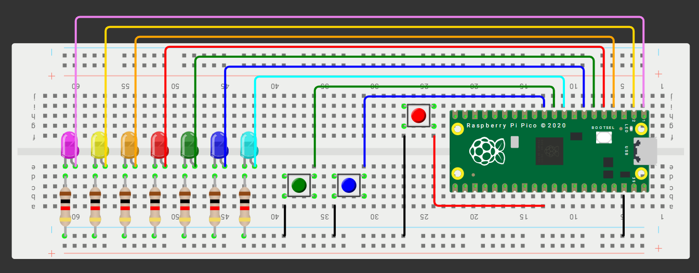

#LED Pong

##Que debe hacer: 

Se trara de un mini-Pong con 5 LEDs en línea y 2 botones usando interrupciones (ISR) para registrar el “golpe” del jugador exactamente cuando la “pelota” (un LED encendido) llega al extremo de su lado.

#Código:

``` 
#include "pico/stdlib.h"
#include "hardware/gpio.h"

#define LED_P1 0
#define L1     1
#define L2     2
#define L3     3
#define L4     4
#define L5     5
#define LED_P2 6

#define BTN_L  7
#define BTN_R  8

volatile bool golpe_L = false;
volatile bool golpe_R = false;
int pos = L3;
int dir = 0;

void boton_isr(uint gpio, uint32_t events) {
    if (gpio == BTN_L) {
        if (pos == L1) golpe_L = true;
        else if (dir == 0) dir = 1;
    }
    else if (gpio == BTN_R) {
        if (pos == L5) golpe_R = true;
        else if (dir == 0) dir = -1;
    }
}

void parpadear_led(int led) {
    for (int i = 0; i < 3; i++) {
        gpio_put(led, 1);
        sleep_ms(200);
        gpio_put(led, 0);
        sleep_ms(200);
    }
}

void reiniciar_juego(int ganador) {
    parpadear_led(ganador);
    pos = L3;
    gpio_put(L3, 1);

    if (ganador == LED_P2) {
        dir = 1;
    } else if (ganador == LED_P1) {
        dir = -1;
    }
}

int main() {
    stdio_init_all();

    const uint32_t MASK = (1u<<LED_P1)|(1u<<L1)|(1u<<L2)|(1u<<L3)|(1u<<L4)|(1u<<L5)|(1u<<LED_P2);
    gpio_init_mask(MASK);
    gpio_set_dir_masked(MASK, MASK);

    gpio_init(BTN_L); gpio_set_dir(BTN_L, false); gpio_pull_up(BTN_L);
    gpio_init(BTN_R); gpio_set_dir(BTN_R, false); gpio_pull_up(BTN_R);

    gpio_set_irq_enabled_with_callback(BTN_L, GPIO_IRQ_EDGE_FALL, true, &boton_isr);
    gpio_set_irq_enabled(BTN_R, GPIO_IRQ_EDGE_FALL, true);

    int pos_anterior = L3;
    gpio_put(pos_anterior, 1);

    while (true) {

        gpio_put(pos_anterior, 0);
        gpio_put(pos, 1);
        pos_anterior = pos;

        sleep_ms(500);

        if (dir == 0) continue;

        if (pos == L1) {
            if (golpe_L) {
                dir = 1;
                golpe_L = false;
            } else {
                reiniciar_juego(LED_P2);
                continue;
            }
        } else if (pos == L5) {
            if (golpe_R) {
                dir = -1;
                golpe_R = false;
            } else {
                reiniciar_juego(LED_P1);
                continue;
            }
        }

        if (pos == L2 && golpe_L) {
            dir = 1;
            golpe_L = false;
        } else if (pos == L4 && golpe_R) {
            dir = -1;
            golpe_R = false;
        }

        pos += dir;
    }
}
```


[Video demostración:][doc-ref]

[doc-ref]:https://www.youtube.com/shorts/lCiT8hK5L0s
