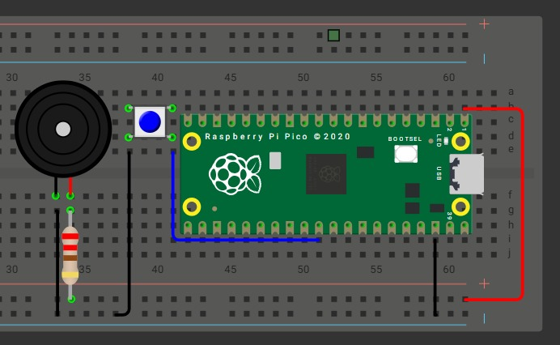

#T7

##Ejercicio7.1 PWM

##Instrucciones:

Implementar un circuito con un motor DC controlado mediante PWM variando el duty cycle.

Usar 2 botones para seleccionar entre 3 velocidades predefinidas (baja, media y alta).

Documentar:

Valores de duty usados, con el porque.

Circuito

##Codigo


```c
#include "pico/stdlib.h"
#include "hardware/pwm.h"
 
#define PWMA   0  
#define AIN1   1  
#define STBY   3  
#define F_PWM_HZ 2000   
#define TOP 1023  
#define BTN_LOW 4
#define BTN_HIGH 5

#define DUTY_LOW  (TOP*30/100)
#define DUTY_HIGH (TOP*75/100)

int main() {

    stdio_init_all();
 
    gpio_init(AIN1);

    gpio_set_dir(AIN1, GPIO_OUT);
 
    gpio_set_function(PWMA, GPIO_FUNC_PWM);

    uint slice = pwm_gpio_to_slice_num(PWMA);
    uint chan  = pwm_gpio_to_channel(PWMA);

    gpio_init(BTN_LOW);
    gpio_set_dir(BTN_LOW, GPIO_IN);
    gpio_pull_up(BTN_LOW);

    gpio_init(BTN_HIGH);
    gpio_set_dir(BTN_HIGH, GPIO_IN);
    gpio_pull_up(BTN_HIGH);

    float f_clk = 150000000.0f; 

    float div = f_clk / (10000 * (TOP + 1));

    pwm_set_clkdiv(slice, div);

    pwm_set_wrap(slice, TOP);

    pwm_set_chan_level(slice, chan, 0);

    pwm_set_enabled(slice, true);
 
    while (1) {

     if (!gpio_get(BTN_LOW)) {
            pwm_set_chan_level(slice, chan, DUTY_LOW);
        }
        if (!gpio_get(BTN_HIGH)) {
            pwm_set_chan_level(slice, chan, DUTY_HIGH);
        }
        sleep_ms(50);
    }
}


 
``` 

##Esquemático

##Video


##Ejercicio7.2 Melodia con buzzer

##Instrucciones:

Programar un buzzer piezoeléctrico para reproducir una melodía reconocible.

Variar la frecuencia del PWM para las notas, manteniendo el duty en 50 %.

Cada nota debe incluir su frecuencia y duración en el código.

```c
#include "pico/stdlib.h"
#include "hardware/pwm.h"
#include <stdio.h>
 
#define PIN_BUZZER 0
#define TOP_PWM 1023
 

#define TEMPO 108
 

#define CLKDIV_MIN 1.0f
#define CLKDIV_MAX 255.0f
 
// duty fijo al 50%
#define DUTY_50 (TOP_PWM/2)
 
typedef struct {
    int frecuencia;   
    int token;        
} Nota;
 

// token: 8 = corchea, 4 = negra, 2 = blanca, 1 = redonda. Token negativo = puntillo (1.5×).
static const Nota melodia[] = {
    {466, 8}, {466, 8}, {466, 8}, {698, 2}, {1047, 2},
    {932, 8}, {880, 8}, {784, 8}, {1397, 2}, {1047, 4},
    {932, 8}, {880, 8}, {784, 8}, {1397, 2}, {1047, 4},
    {932, 8}, {880, 8}, {932, 8}, {784, 2},
    {523, 8}, {523, 8}, {523, 8}, {698, 2}, {1047, 2},
    {932, 8}, {880, 8}, {784, 8}, {1397, 2}, {1047, 4},
    {932, 8}, {880, 8}, {784, 8}, {1397, 2}, {1047, 4},
    {932, 8}, {880, 8}, {932, 8}, {784, 2},
    {523, -8}, {523, 16}, {587, -4}, {587, 8},
    {932, 8}, {880, 8}, {784, 8}, {698, 8}, {698, 8},
    {784, 8}, {880, 8}, {784, 4}, {587, 8}, {659, 4},
    {523, -8}, {523, 16}, {587, -4}, {587, 8},
    {932, 8}, {880, 8}, {784, 8}, {698, 8}, {1047, -8}, {784, 16}, {784, 2},
    {0, 8}, {523, 8}, {587, -4}, {587, 8},
    {932, 8}, {880, 8}, {784, 8}, {698, 8}, {698, 8},
    {784, 8}, {880, 8}, {784, 4}, {587, 8}, {659, 4},
    {1047, -8}, {1047, 16}, {1397, 4}, {1245, 8}, {1109, 4},
    {1047, 8}, {932, 4}, {831, 8}, {784, 4}, {698, 8}, {1047, 1}
};
 
static const int MELODIA_LEN = sizeof(melodia) / sizeof(melodia[0]);
 
static inline float limitar_f(float v, float minimo, float maximo) {
    if (v < minimo) return minimo;
    if (v > maximo) return maximo;
    return v;
}
 
int calcular_duracion_ms(int tempo, int token) {

    float nota_entera = (60000.0f / tempo) * 4.0f;
    float duracion;
    if (token > 0) {
        duracion = nota_entera / (float)token;
    } else {

        duracion = nota_entera / (float)(-token);
        duracion *= 1.5f;
    }
    return (int)(duracion + 0.5f);
}
 
int main() {
    stdio_init_all();

    gpio_set_function(PIN_BUZZER, GPIO_FUNC_PWM);
    uint slice = pwm_gpio_to_slice_num(PIN_BUZZER);
    uint canal = pwm_gpio_to_channel(PIN_BUZZER);
    pwm_set_wrap(slice, TOP_PWM);
    pwm_set_chan_level(slice, canal, 0);
    pwm_set_enabled(slice, true);
 
    const int tempo = TEMPO;
 
    while (true) {
        for (int i = 0; i < MELODIA_LEN; i++) {
            int freq = melodia[i].frecuencia;
            int token = melodia[i].token;
 
            int notaMs = calcular_duracion_ms(tempo, token);
 
            if (freq == 0) {

                pwm_set_chan_level(slice, canal, 0);
                sleep_ms((int)(notaMs * 0.9f));
            
                sleep_ms((int)(notaMs * 0.1f));
                continue;
            }
 
            const float f_clk = 125000000.0f;
            float clkdiv = f_clk / ((float)freq * (TOP_PWM + 1));
            clkdiv = limitar_f(clkdiv, CLKDIV_MIN, CLKDIV_MAX);
            pwm_set_clkdiv(slice, clkdiv);
 
            pwm_set_chan_level(slice, canal, DUTY_50);
            
            sleep_ms((int)(notaMs * 0.9f));
 
            pwm_set_chan_level(slice, canal, 0);
            sleep_ms((int)(notaMs * 0.1f));
        }
 
        
        sleep_ms(1500);
    }
 
    return 0;
}
```

