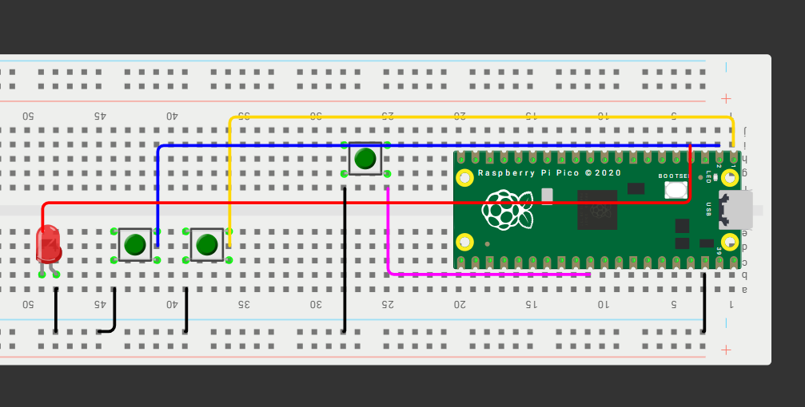
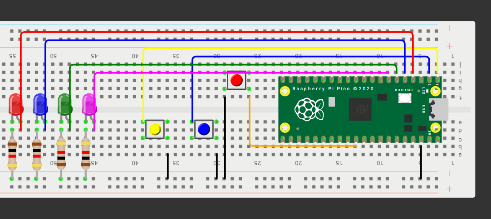

#T3 Inputs
##3 compuertas básicas, AND / OR / XOR con 2 botones
###Qué debe hacer:

 Con dos botones A y B (pull-up; presionado=0) enciende tres LEDs que muestren en paralelo los resultados de AND, OR y XOR. En el video muestra las 4 combinaciones (00, 01, 10, 11).

###Código: Para compuerta AND

```c
#include "pico/stdlib.h"
#include "hardware/gpio.h"

#define BTN_A 0
#define BTN_B 1
#define LED_AND 2

int main() {
    stdio_init_all();

    gpio_init(BTN_A);
    gpio_set_dir(BTN_A, false);
    gpio_pull_up(BTN_A);

    gpio_init(BTN_B);
    gpio_set_dir(BTN_B, false);
    gpio_pull_up(BTN_B);

    gpio_init(LED_AND);
    gpio_set_dir(LED_AND, true);

    while (true) {
        bool a = !gpio_get(BTN_A);
        bool b = !gpio_get(BTN_B);

        bool result = a && b;

        gpio_put(LED_AND, result);

        sleep_ms(50);
    }
}

```
[Video demostración:][doc-ref]

[doc-ref]:https://youtube.com/shorts/Al4uy3-YmbE?feature=share

###Código: Para compuerta OR

```c

#include "pico/stdlib.h"
#include "hardware/gpio.h"

#define BTN_A 0
#define BTN_B 1
#define LED_OR 2

int main() {
    stdio_init_all();

    gpio_init(BTN_A); gpio_set_dir(BTN_A, false); gpio_pull_up(BTN_A);
    gpio_init(BTN_B); gpio_set_dir(BTN_B, false); gpio_pull_up(BTN_B);

    gpio_init(LED_OR); gpio_set_dir(LED_OR, true);

    while (true) {
        bool a = !gpio_get(BTN_A);
        bool b = !gpio_get(BTN_B);

        bool result = a || b;

        gpio_put(LED_OR, result);
        sleep_ms(50);
    }
}

```

[Video demostración:][doc-ref]

[doc-ref]:https://youtube.com/shorts/1P4SH7KxhFU


###Código: Para compuerta XOR

```c
#include "pico/stdlib.h"
#include "hardware/gpio.h"

#define BTN_A 0
#define BTN_B 1
#define LED_XOR 2

int main() {
    stdio_init_all();

    gpio_init(BTN_A); gpio_set_dir(BTN_A, false); gpio_pull_up(BTN_A);
    gpio_init(BTN_B); gpio_set_dir(BTN_B, false); gpio_pull_up(BTN_B);

    gpio_init(LED_XOR); gpio_set_dir(LED_XOR, true);

    while (true) {
        bool a = !gpio_get(BTN_A);
        bool b = !gpio_get(BTN_B);

        bool result = a ^ b;

        gpio_put(LED_XOR, result);
        sleep_ms(50);
    }
}

```

[Video demostración:][doc-ref]

[doc-ref]:https://youtube.com/shorts/eoCzc6YgBfI


###Esquemático de conexión:

 Se usó las mismas conexiones para las 3 diferentes compuertas.



##Selector cíclico de 4 LEDs con avance/retroceso

###Que debe hacer: 

Mantén un único LED encendido entre LED0..LED3. Un botón AVANZA (0→1→2→3→0) y otro RETROCEDE (0→3→2→1→0). Un push = un paso (antirrebote por flanco: si dejas presionado no repite). En el video demuestra en ambos sentidos.

###Código

```c
#include "pico/stdlib.h"

#define BTN_PREV 0      
#define BTN_NEXT 1    
#define LED0   2
#define LED1   3
#define LED2   4
#define LED3   5

uint8_t STATE = LED0 - 1;

int main(void) {
    const uint8_t LEDs_M = (1u << LED0 | 1u << LED1 | 1u << LED2 | 1u << LED3);

    gpio_init_mask(LEDs_M);
    gpio_set_dir_out_masked(LEDs_M);
    gpio_set_mask(LEDs_M);   
    gpio_clr_mask(LEDs_M);

    gpio_init(BTN_PREV);
    gpio_set_dir(BTN_PREV, GPIO_IN);
    gpio_pull_up(BTN_PREV);

    gpio_init(BTN_NEXT);
    gpio_set_dir(BTN_NEXT, GPIO_IN);
    gpio_pull_up(BTN_NEXT);

    bool NEXT_PREVSTATE = 1;
    bool PREV_PREVSTATE = 1;

    while (true) {
        bool NEXT_STATE = !gpio_get(BTN_NEXT);
        bool PREV_STATE = !gpio_get(BTN_PREV);

        if (NEXT_STATE && !NEXT_PREVSTATE) {
            if (STATE == LED3) {
                STATE = LED0;
            } else {
                STATE ++;
            }
            gpio_clr_mask(LEDs_M);                
            gpio_set_mask(1 << STATE);              
        }

        if (PREV_STATE && !PREV_PREVSTATE) {
            if (STATE == LED0) {
                STATE = LED3;
            } else {
                STATE --;
            }
            gpio_clr_mask(LEDs_M);                
            gpio_set_mask(1 << STATE);              
        }

        NEXT_PREVSTATE = NEXT_STATE;
        PREV_PREVSTATE = PREV_STATE;

        sleep_ms(10);
    }
}
```
###Esquemático:




[Video demostración:][doc-ref]

[doc-ref]:https://youtube.com/shorts/-E7wB8Z-OBw
